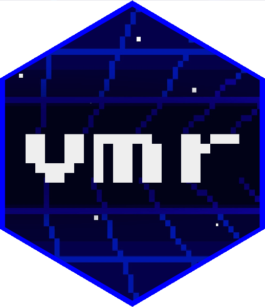

# vmr - Virtual Machines for R 

<!-- badges: start -->
[](https://gitlab.com/rstuff/vmr/-/commits/master)
<!-- badges: end -->

A R package to manage Virtual Machines using _Vagrant_ tool.  

## Purpose

This package is a wrap of the [Vagrant](https://www.vagrantup.com/) tool and more.  
It allows to manage, provision and use Virtual Machines preconfigured for R.    

It currently only use VirtualBox (>= 6.1.14) as provider. 
Vagrant tool have to be installed too. (See [Dependencies](#dependencies))

Used VMs come from [https://app.vagrantup.com/VMR](https://app.vagrantup.com/VMR) repository
and the sources use to generate them can be found at 
[https://gitlab.com/rstuff/vms](https://gitlab.com/rstuff/vms).

## Dependencies

### Tools

* [Vagrant](https://www.vagrantup.com/) (>= 2.2.10)

### Providers

* [VirtualBox](https://www.virtualbox.org/) (>= 6.1.14)

## Install

```R
# From CRAN
install.packages(c('vmr'))
# or from the development repository (latest version)
remotes::install_git('https://gitlab.com/rstuff/vmr.git')
```

## Documentation

Online : [https://rstuff.gitlab.io/vmr/](https://rstuff.gitlab.io/vmr/)  

```r
browseVignettes(package = "vmr")
```

## Authors

* Jean-François Rey \<jf.rey.public[at]gmail.com\>

## LICENSE

GPLv3

